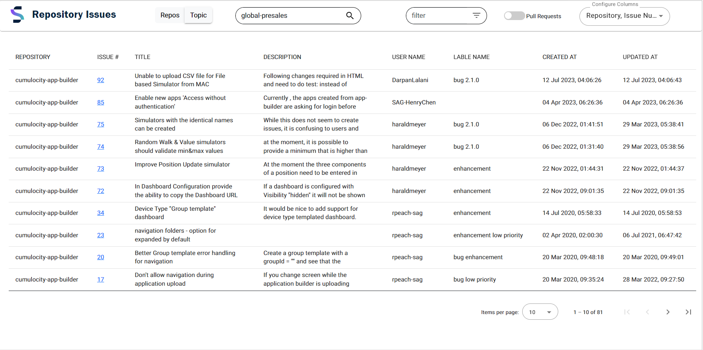

# Open Source Repository Issues

This application simplifies tracking Software AG GitHub repository issues. It efficiently fetches data on open issues and presents it in a user-friendly tabular format. With added functionalities, analyzing the data becomes effortless, providing users with an enhanced experience. 
 
This project was generated with [Angular CLI](https://github.com/angular/angular-cli) version 16.0.3.

 

### Screen Shot

###

These tools are provided as-is and without warranty or support. They do not constitute part of the Software AG product suite. Users are free to use, fork and modify them, subject to the license agreement. While Software AG welcomes contributions, we cannot guarantee to include every contribution in the master project.

